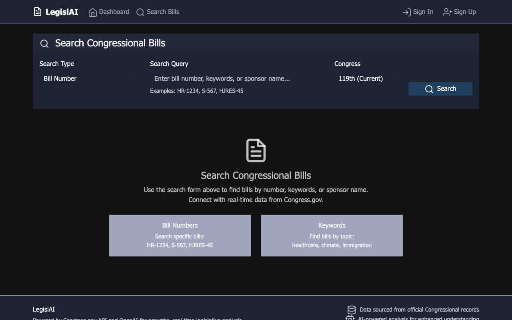
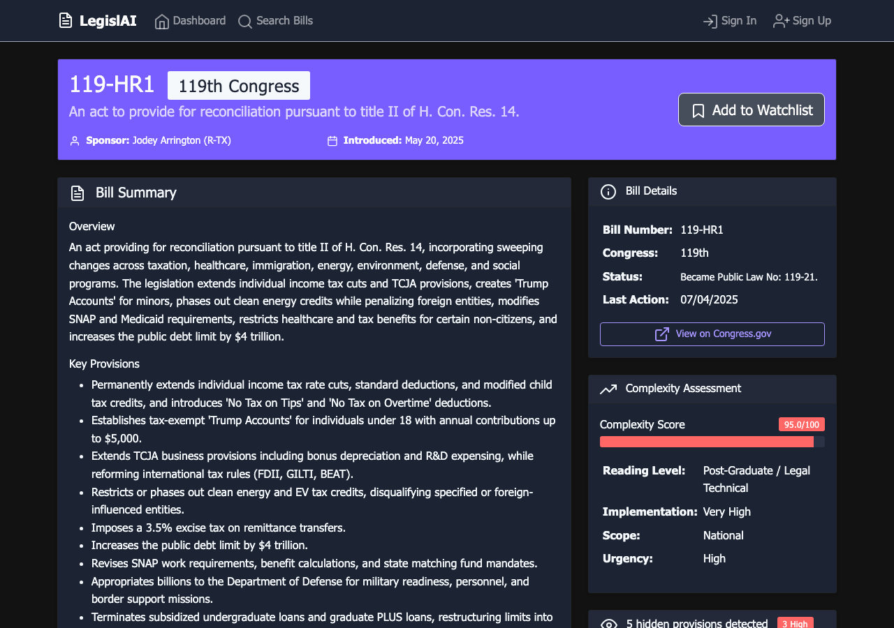
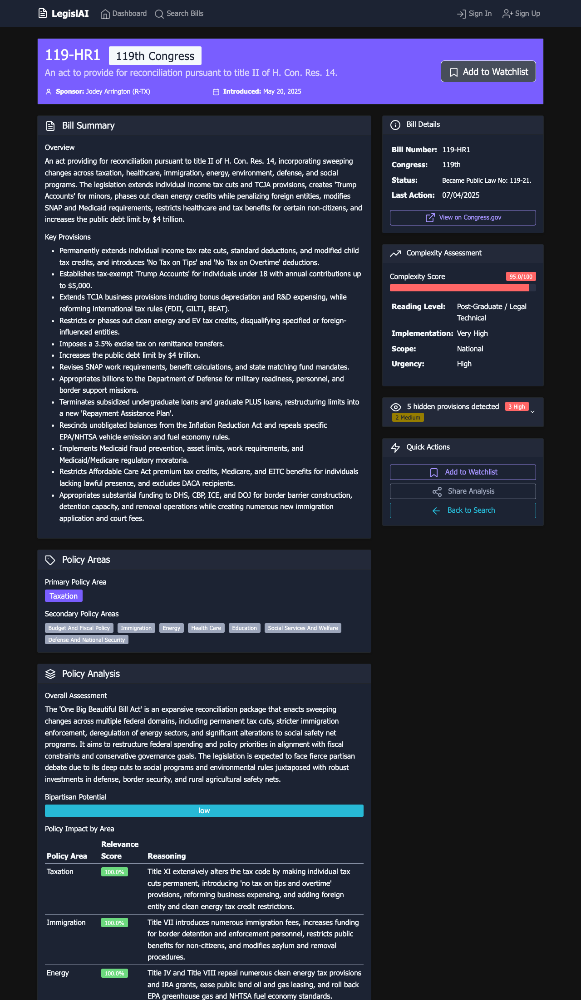
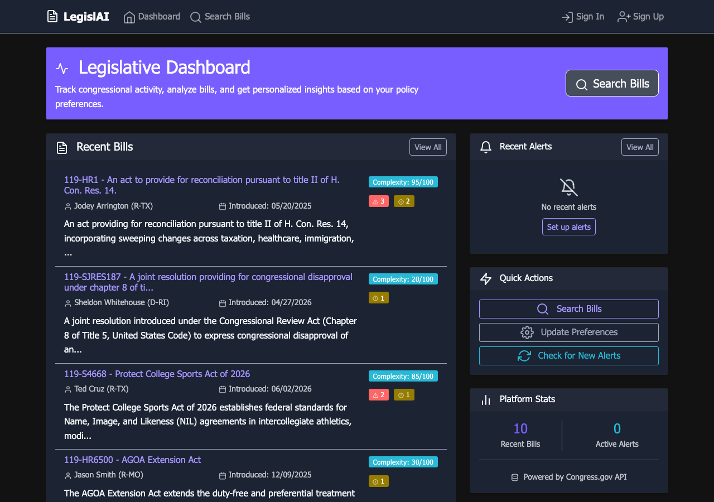
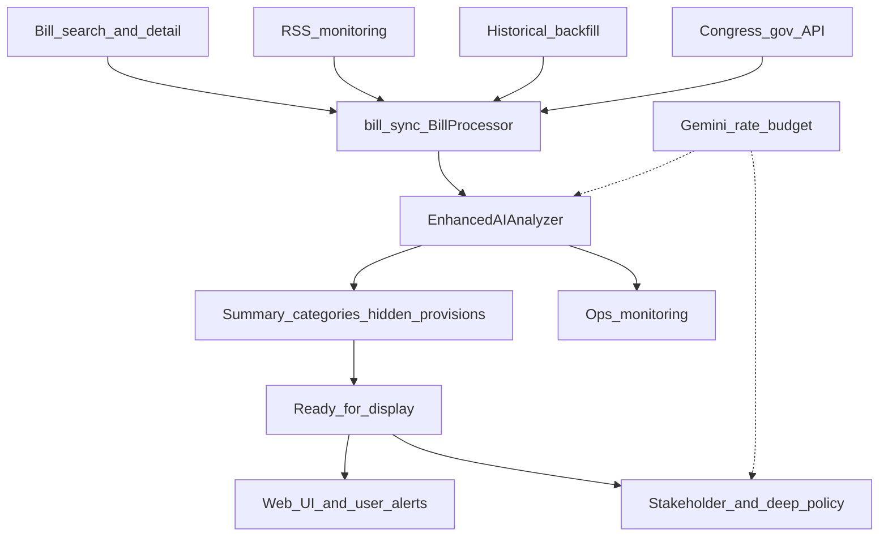

# LegislAI

**LegislAI** is a Flask app that turns U.S. congressional bills into readable analysis—summaries, policy themes, hidden-provision findings, and alerts—using the Congress.gov API and Gemini.

**Stack:** Python, Flask, SQLAlchemy, Gemini, Congress.gov API, RSS monitoring, Jinja templates

## Why this is interesting

- **Several ingest paths, one ETL** — bill search, RSS, and historical backfill all sync through the same bill processor
- **Size-aware AI analysis** — short bills in one pass; long bills via resumable map/reduce chunks
- **Core vs enrichments** — summaries and hidden provisions show up first; stakeholder and deep policy analysis fill in afterward
- **Shared rate budget and work leases** — search, RSS, and backfill do not fight over the same Gemini minute or the same bill
- **Built to extend** — civic/nonprofit information layer, or freemium product with premium depth

> Personal project / portfolio demo. Tuned for free-tier Gemini quotas. Not a production SaaS.

## Screenshots

| Search | Bill analysis |
|--------|----------------|
|  |  |

| Hidden provisions | Dashboard |
|-------------------|-----------|
|  |  |

See [docs/screenshots/](docs/screenshots/) for asset notes. Replace placeholders after a local run if images are missing.

## What it does

1. **Ingests** bills from several entry points (search/detail, RSS, and backfill—all via Congress.gov).
2. **Normalizes and stores** metadata, full text, and congressional actions.
3. **Analyzes** each bill with Gemini—short bills in one pass, long bills in chunks.
4. **Shows results** in the UI once core analysis is ready, then fills in deeper enrichments in the background.
5. **Notifies** users when analysis matches their policy interests (when notifications are enabled).

### Ingestion paths

| Path | What it is for |
|------|----------------|
| **Bill search / detail (web)** | Someone looks up a bill; LegislAI fetches or refreshes it from the Congress.gov API on demand |
| **RSS monitoring** | Continuous watch of Congress RSS feeds for newly appearing items |
| **Historical backfill** | Careful catch-up over past congresses or gaps in the database |
| **Congress.gov API** | Shared source of truth for bill details, text, and actions behind all of the above |

All of those paths funnel into the same ETL layer so search, RSS, and backfill do not invent different data shapes.

### ETL (extract, transform, load)

- **Congress API client** spaces requests so you stay within congressional API limits.
- **Bill sync** decides whether to refresh recent activity or pull full content.
- **Bill processor** writes metadata, full text, and actions into the database (with content-hash versioning).
- Ingest **does not** call the AI—storage stays separate from analysis.

### Analysis

- **Core analysis** produces a summary, policy category labels, complexity/controversy signals, and **hidden provision** findings.
- **Size-aware routing:** smaller bills get a full-text pass; oversized bills are split into map/reduce chunks and can resume if a wave runs out of quota.
- **Enrichments** (stakeholder analysis, deeper policy narrative) run afterward so the page can show useful results before those finish.
- A shared rate budget and work leases keep search, RSS, and backfill from trampling each other on the same bill or the same Gemini minute.

### What you see in the product

- Search and bill analysis pages with progressive loading while work is in flight
- Policy area badges vs. longer policy narrative (different sections on purpose)
- Collapsible hidden-provisions findings backed by the database
- User preferences, alerts, and an admin/ops view for monitoring pipeline health

## Architecture



More detail on each service module: [services/README.md](services/README.md).

## Build on top

### Non-profit / civic

Run LegislAI as a public-interest layer: keep bill text and analysis **accurate and current**, and make that information available to journalists, researchers, and the public.

### For-profit / freemium

Offer free core search and analysis, and charge for depth:

| Often free | Strong premium candidates |
|------------|---------------------------|
| Bill search and metadata | Hidden provisions |
| Core summary and policy areas | Stakeholder analysis |
| Progressive analysis UX | Deep policy narrative |
| Basic preference alerts | Feed subscriptions and bill-analysis alerts |

## Fine-tuning

You do not have to stay on free-tier defaults.

**Models** — Change `GEMINI_MODEL` in [utils/constants.py](utils/constants.py) and use a paid or higher-quota `GEMINI_API_KEY` (see [.env.example](.env.example)). Analysis rows record which model produced them, so history stays honest after you switch.

**Guardrails** — Adjust the shared Gemini request/token budget, Congress API spacing, bill work leases, and the regex heuristics used before hidden-provision detection. These live mainly under [services/](services/README.md) (`gemini_rate_budget`, `congress_api`, `bill_work_lease`, and the analyzer’s `suspicious_patterns`).

**Token estimates** — Tier choice and “how much room is left this minute” use **approximate** math (`characters × ~0.30`), not a perfect tokenizer. If you change models or the kind of text you analyze, recalibrate those assumptions in the analyzer or leftover-capacity estimates will drift.

## Future directions

Ideas that fit naturally on this foundation:

- Stronger paid models and richer chat over bills (and eventually statutes)
- GovInfo / “law on the books” so proposed text can be compared to current law
- A red/green **diff** of what a bill would change in existing code
- Packaged data feeds (summaries, hidden provisions, stakeholder packs) for organizations
- Tighter alert products: batch digests for free users, near-real-time analysis alerts for subscribers

## Quick start

### Local

```bash
cp .env.example .env   # fill in keys; never commit .env
pip install -r requirements.txt
flask db upgrade
python main.py         # http://localhost:5000
```

You will want `GEMINI_API_KEY` and `CONGRESS_API_KEY` for live analysis. Admin/ops sign-in uses `LEGISLAI_ADMIN_*` from the template. Session signing uses `SESSION_SECRET`.

### Docker

```bash
cp .env.example .env   # add API keys for live analysis
docker compose up --build
# open http://localhost:5055  (host 5055 → container 5000; avoids macOS/AirPlay on 5000)
```

SQLite data persists in a Docker volume. Without API keys the UI still boots; analysis and Congress fetches will not run.

## License

MIT — see [LICENSE](LICENSE).

## Security

Before cloning this as a public portfolio reference, read [docs/SECURITY.md](docs/SECURITY.md) (rotate keys if this repo was ever private with real credentials).

## Where to read next

| Doc | What it covers |
|-----|----------------|
| [services/README.md](services/README.md) | Every service, with diagrams |
| [docs/README.md](docs/README.md) | Index of live technical docs |
| [docs/SECURITY.md](docs/SECURITY.md) | Secrets hygiene |
| [docs/ENHANCED_ANALYSIS_PIPELINE_DOCUMENTATION.md](docs/ENHANCED_ANALYSIS_PIPELINE_DOCUMENTATION.md) | How analysis tiers work |
| [docs/WORKFLOW_README.md](docs/WORKFLOW_README.md) | RSS workflow orchestrator |
| [PROJECT_STRUCTURE.md](PROJECT_STRUCTURE.md) | Folder layout |
| [AGENTS.md](AGENTS.md) | Conventions for AI-assisted development on this repo |
| [archives/docs/](archives/docs/) | Older implementation notes |
