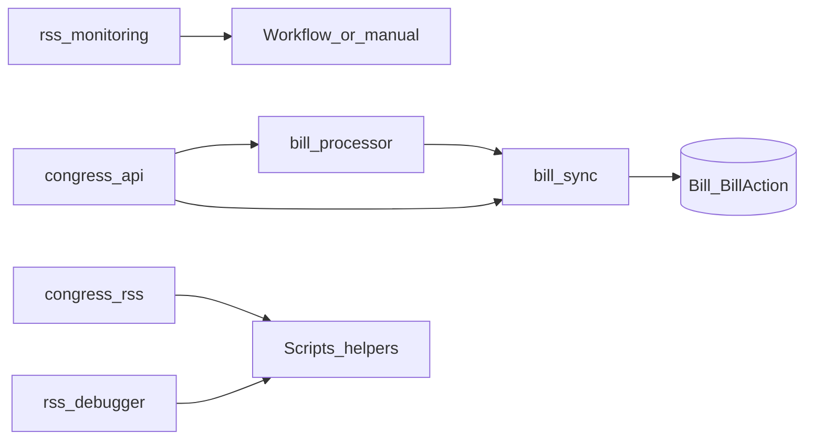
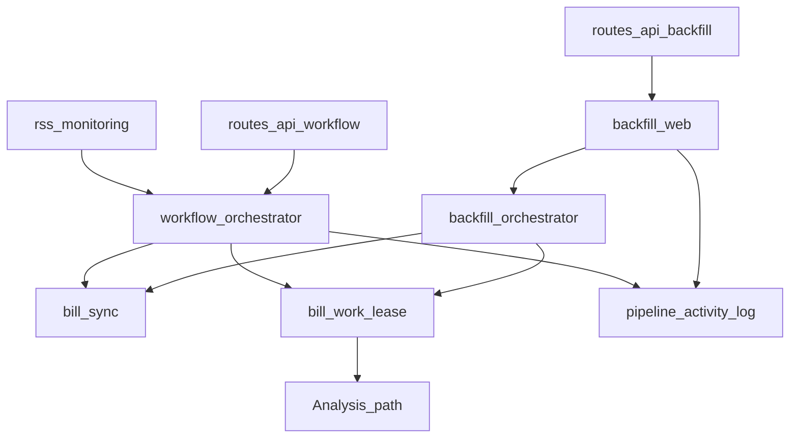
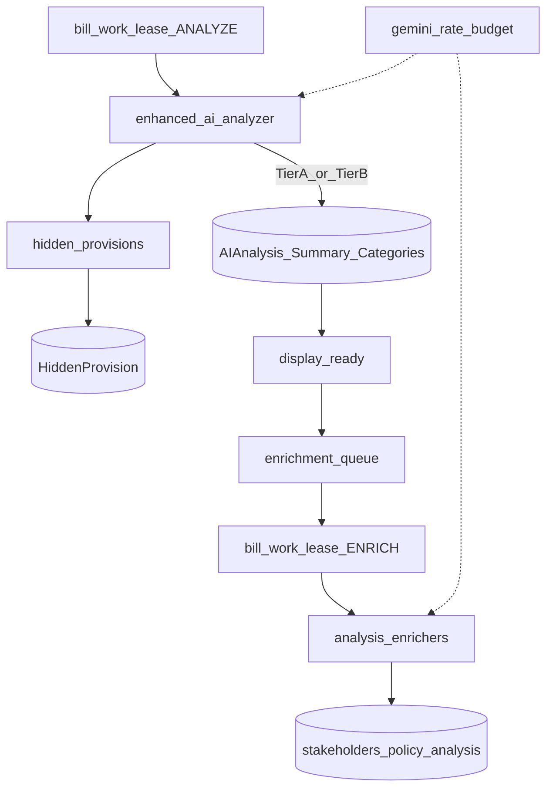
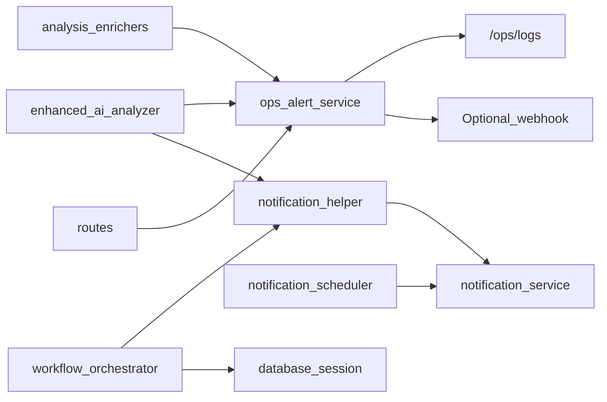

# LegislAI services

Business-logic layer under `services/`. For the end-to-end product picture, see the [root README](../README.md). Implementation contracts for agents: [pipeline-contract](../.cursor/resources/pipeline-contract.md).

**Invariants**

- **`bill_sync` / `BillProcessor` never run Gemini** — ingest and persist only.
- **Downstream enrichers never set `display_ready`** — core analysis owns readiness; stakeholders / deep policy analysis are async after core.

---

## Ingest / ETL

| Module | Responsibility | Primary callers |
|--------|----------------|-----------------|
| [`congress_api.py`](congress_api.py) | Congress.gov client (details, text, actions, search); request spacing ~3.6s; shared via `get_shared_congress_api()` | `bill_processor`, `bill_sync`, routes, workflow, backfill |
| [`congress_rss.py`](congress_rss.py) | One-shot RSS parse / keyword helpers over Congress feeds | Scripts; workflow prefers `rss_monitoring` |
| [`rss_monitoring.py`](rss_monitoring.py) | Continuous RSS with `seen_items.json` dedupe (`PersistentRSSMonitor`) | `workflow_orchestrator` |
| [`rss_debugger.py`](rss_debugger.py) | Ad-hoc feed debug utilities | Manual / scripts |
| [`bill_processor.py`](bill_processor.py) | Persist metadata, full text, actions; content-hash versioning; ingest-only in `process_bill_data` | `bill_sync`, backfill, routes |
| [`bill_sync.py`](bill_sync.py) | Unified ETL entry: activity refresh vs content ingest (`sync_bill`, `refresh_activity`); never sets `display_ready` | Routes, workflow, backfill |

---

## Orchestration

| Module | Responsibility | Primary callers |
|--------|----------------|-----------------|
| [`workflow_orchestrator.py`](workflow_orchestrator.py) | RSS loop → sync → analyze → alerts; Flask-independent DB session | `/api/workflow/*`, `start_workflow_service()` |
| [`backfill_orchestrator.py`](backfill_orchestrator.py) | Historical discovery / gap / analysis backfill with resume state | CLI `main()`, `backfill_web` |
| [`backfill_web.py`](backfill_web.py) | In-process backfill control + status for Flask admin UI | `/api/backfill/*` |
| [`pipeline_activity_log.py`](pipeline_activity_log.py) | In-memory ring buffers for RSS/backfill admin UIs | Workflow, backfill, routes |
| [`bill_work_lease.py`](bill_work_lease.py) | Cross-ingestor locks (`KIND_ANALYZE` / `KIND_ENRICH`; TTLs ~20m / ~10m) | Routes, workflow, backfill, enrichment_queue |

---

## Analysis

| Module | Responsibility | Primary callers |
|--------|----------------|-----------------|
| [`enhanced_ai_analyzer.py`](enhanced_ai_analyzer.py) | Size-aware Gemini: Tier A full-text / Tier B map-reduce; persist core artifacts; shared via `get_shared_ai_analyzer()` | Routes, workflow, backfill |
| [`gemini_rate_budget.py`](gemini_rate_budget.py) | Process-wide FIFO RPM/TPM + optional DB ceiling; defaults tuned for free tier | Analyzer, enrichers (via analyzer) |
| [`hidden_provisions.py`](hidden_provisions.py) | Canonical `HiddenProvision` writes / heal-from-analysis; UI reads the table only | Analyzer persist path, routes heal |
| [`analysis_enrichers.py`](analysis_enrichers.py) | Async stakeholders + deep `policy_analysis` after core; RPM-gated | `enrichment_queue` |
| [`enrichment_queue.py`](enrichment_queue.py) | Shared async enrichment dispatcher; quota deferral without churning analysis versions | Routes, workflow, backfill |

Token routing and leftover-capacity math use **presumed** arithmetic (`estimated_tokens_per_char`, etc.) — see [root README fine-tuning](../README.md#presumed-token-arithmetic).

---

## Ops, notifications, and DB session

| Module | Responsibility | Primary callers |
|--------|----------------|-----------------|
| [`ops_alert_service.py`](ops_alert_service.py) | Persist `OpsAlert` + optional webhook; independent of user notifications | Analyzer, enrichers, routes, workflow, backfill |
| [`notification_service.py`](notification_service.py) | User email / in-app alerts from preferences | Helper, scheduler |
| [`notification_helper.py`](notification_helper.py) | Thin wrappers (`trigger_bill_analysis_notification*`) to avoid circular imports | Analyzer, workflow |
| [`notification_scheduler.py`](notification_scheduler.py) | Scheduled digest-style sends | App lifecycle (often optional / commented in `app.py`) |
| [`database_session.py`](database_session.py) | Non-Flask SQLAlchemy sessions for background workflow | `workflow_orchestrator` |

User notifications are gated by `NOTIFICATIONS_ENABLED` / `FLASK_ENV` (see [`docs/NOTIFICATION_ENVIRONMENT_CONTROLS.md`](../docs/NOTIFICATION_ENVIRONMENT_CONTROLS.md)). Ops alerts use `OPS_ALERT_*` independently.

---

## Package marker

| Module | Responsibility |
|--------|----------------|
| [`__init__.py`](__init__.py) | Package marker (empty) |
